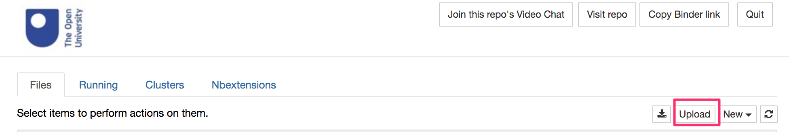
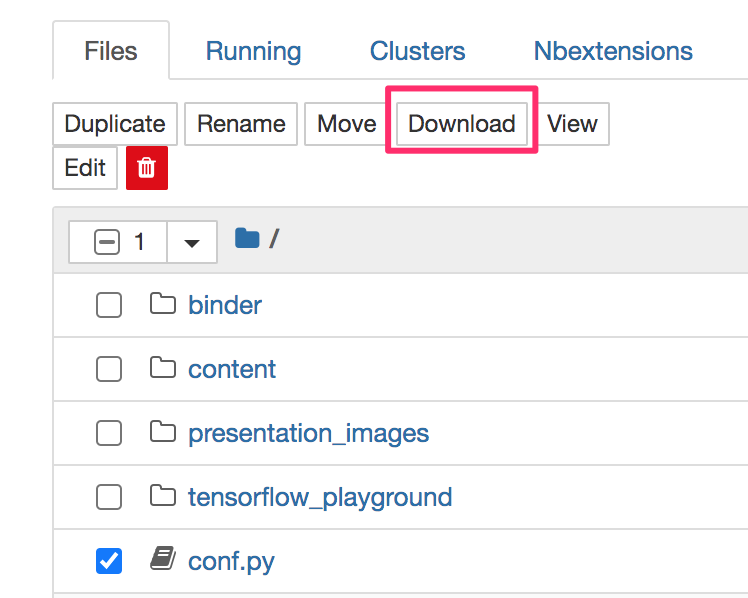

---
jupyter:
  jupytext:
    notebook_metadata_filter: rise
    text_representation:
      extension: .md
      format_name: markdown
      format_version: '1.2'
      jupytext_version: 1.4.2
  kernelspec:
    display_name: Python 3
    language: python
    name: python3
  rise:
    enable_chalkboard: true
    scroll: true
---

## Saving and Checkpointing Your Work

Within the notebook environment, the file will be saved automatically every 120 seconds (which is to say, every two minutes).

If you have changed the notebook since it was last autosaved, you will see a statement like the following next to the notebook filename at the top of the notebook:

`Last Checkpoint: Last Friday at 12:18 AM
(unsaved changes)`

The `(unsaved changes)` phrase is akin to the `*` indicator you often see next to a filename in a document editor that shows the file has changed since it was last saved.

If you watch for at most a couple of minutes, you'll note that it soon changes to something with the following form:

`Last Checkpoint: Last Friday at 12:18 AM
(autosaved)`

You can change the autosave period using magic (yes, really! That's what it's called...). For example, run the following statement in a notebook code cell and it will change the autosave period *for that notebook only* to 60 seconds:

`%autosave 60`

The autosave time can also be set using the `AutoSaveTime` notebook extension which can be enabled from the `nbextensions configurator` [[direct link](/nbextensions/?nbextension=autosavetime/main)].

As well as allowing your notebooks to be automatically saved, you can also "checkpoint" them.

When you use a keyboard shortcut to manually save the file, or you save a notebook document from the notebook `File` menu, you are actually issuing a `Save and Checkpoint` command. This saves in the same way that the autosave function does, but it *also* generates a checkpointed (backed up) version of the file in the hidden `.ipynb_checkpoints` folder.

What this means is that if you work on a file, allowing it to be autosaved, and realise that you have made some terrible mistakes in it, you can revert the notebook to a previously checkpointed (manually saved) version.

Note that this will throw away all changes made to the autosaved version of the notebook since the last manual (checkpointing) save, so use this command with care.

*See also `synchronising_desktop_and_docker_files.md`.*

## Downloading and Uploading Files

Another way of saving files is to __download__ them to your own computer desktop and then upload then when you want to work on them again. The *Download* button will download the current notebook to you desktop. You can then upload a notebook saved to your desktop using the *Upload* button on the notebook server home page.

The "down" arrow button on the top right-hand side notebook homepage will zip and download *all* the files in the notebook listing, including all the files in any subdirectories / subfolders.

Alternatively, if you check a single file from the notebook homepage, you can choose to selectively download just that file by clicking the *Download* button from that is displayed when you check the item.

You can __upload__ files via any notebook server homepage. Simply click on the upload button and select the file you want to upload:

If you upload a `.zip` file, you will need to unzip it.

From the notebook homepage `Open` menu, open a new terminal.

Optionally, enter the command `ls` and hit return to list the files in the current directory and check the file name. To unzip your uploaded file, for example `upload.zip`, run the command:

`unzip upload.zip`

## Backing Up Work on `MyBinder`

If you are working on `MyBinder`, which is ordinarily a transient environment with no mechanism for saving files, you can save and retrieve notebooks using your web browser's local storage mechanism. See the *Using Browser Storage* section in `using_mybinder.md` for more details. 