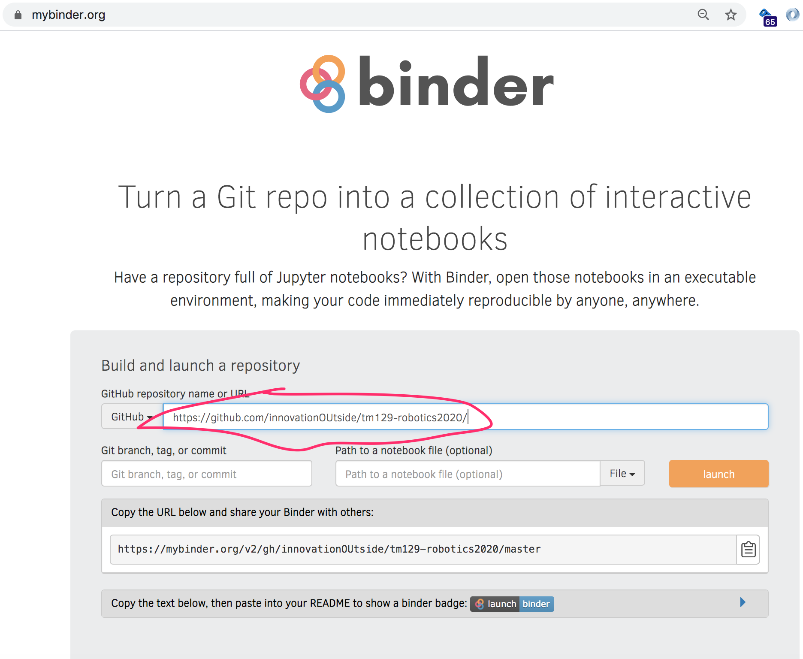

---
jupyter:
  jupytext:
    notebook_metadata_filter: rise
    text_representation:
      extension: .md
      format_name: markdown
      format_version: '1.2'
      jupytext_version: 1.4.2
  kernelspec:
    display_name: Python 3
    language: python
    name: python3
  rise:
    enable_chalkboard: true
    scroll: true
---

### Accessing Open Computing Lab Ennvironments Online - MyBinder / BinderHub

You can access *Open Computing Lab* environments online using the [MyBinder](https://mybinder.org/) service.

Open COmputing Lab environment homepages will typically have a Binder button displayed on them:
 

Clicking such a button will launch a temporary / transient version of the environment for you on a third party server.

You can launch your own environments from the MyBinder home page — https://mybinder.org — uding the web address / URL of an Open Computing Lab Github repository.

For example, given the web location of the repository `https://github.com/innovationOUtside/tm129-robotics2020/`, we can enter that into the form on the MyBinder launch page:

Clicking the launch button will the build the environment from the repository contents if a prebuilt image of the environment is not already available, and then launch the environment. (Note, this may take a few minutes if the environment needs ot be built from scratch.)

### Saving Files Used On MyBinder

If you want to save any of the notebooks used there, you will have to download them as follows:

- as a single notebook from the notebook page `File` menu;
- as a zipped archive file of all notebooks using the the download button on the notebook homepage.

You can also upload your own notebooks from the notebook homepage either individually, or as a zip file. If you upload a zip file, you will need to unzip it. You can do this from a notebook command cell using the `unzip` shell command or [using Python code](https://thispointer.com/python-how-to-unzip-a-file-extract-single-multiple-or-all-files-from-a-zip-archive/). 

The environment launched from MyBinder is ephemeral - it is created on demand when you click a `launch binder` button and is destroyed after a short period of inactivity.

To save your work when working on MyBinder, there are two approaches you can take:

- using browser storage;
- downloading and uploading files.

##### Using Browser Storage

When running a notebook in MyBinder, on the toolbar you will see a group of three icons:

The cloud buttons with the up and down arrows can be used to save the current notebook using your web browser's file storage mechanism.

Click the cloud with the down arrow (*Save to browser storage*) to save a copy of the notebook in your browser's file store. Note that you can do this even if the MyBinder session has timed out, as long as you can see the notebook in your browser.

If you create another MyBinder session at a later time, and open a notebook from the notebook home page, if you remember previously having saved that notebook to notebook storage, you can press the cloud button with the up arrow (*Restore from browser storage*) to replace the copy of the notebook provided by MyBinder by default with the copy you previously saved.

This is a little bit clunky, and means you have to remember that you saved a notebook to browser storage, but it works!

Note also that you save the file to the storage associated with a particular browser. If you save a notebook when using a Firefox browser, the files will not be available if you later visit MyBinder using Chrome.

__TO CHECK: does file storage synch across logged in instances of Chrome?__ 

See also the section *Downloading and Uploading Files* in `saving_and_checkpointing_work.md`.

